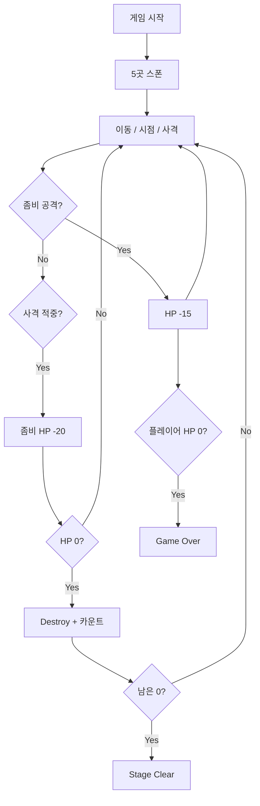

# 게임 스펙 & 시스템 상세

## 컨셉

3D 1인칭 좀비 서바이벌 슈팅 **Stage 1** 프로토타입.  
에셋 스토어 없이 Capsule·Cube·Sphere 등 **Unity 기본 Primitive**만 사용.

---

## 수치 표

| 요소 | 값 |
|------|-----|
| 좀비 수 | 5 (스폰 포인트 수) |
| 좀비 HP | 40 |
| 좀비 이동 속도 | 2.5 |
| 좀비 공격 거리 | 1.5 |
| 좀비 공격 쿨다운 | 1.0초 |
| 좀비 공격 데미지 | 15 |
| 플레이어 HP | 100 |
| 총기 데미지 | 20 |
| 총기 사거리 | 100 |
| 총기 연사 쿨다운 | 0.2초 |
| 걷기 / 달리기 | 5 / 8 |
| 가속도 | 10 |
| 점프 높이 | 1.2 |
| 마우스 감도 | 2 |
| 최대 상하 시야각 | ±90° |

---

## 승패 조건

| 결과 | 조건 | UI | 기타 |
|------|------|-----|------|
| 승리 | 생존 좀비 0 | `Stage 1 Clear!` | `timeScale = 0` |
| 패배 | 플레이어 HP ≤ 0 | `Game Over` | `timeScale = 0` |
| 재시작 | 종료 후 **R** | 씬 리로드 | `timeScale` 복구 |

---

## 씬 오브젝트

### 맵

| 오브젝트 | 타입 | 대략적 Transform |
|----------|------|------------------|
| Floor | Cube 20×1×20 | pos (0,0,0) |
| Wall_N/S/E/W | Cube | 경계 사각형 |
| SpawnPoint_1~5 | Empty | [BUILD_FROM_SCRATCH.md](BUILD_FROM_SCRATCH.md) 참고 |

### Player 계층

```
Player (Tag: Player, Layer: Player)
├── PlayerCamera (Camera + AudioListener)
│   └── Muzzle  local (0, -0.1, 0.45)
└── (런타임) ShotTracer, MuzzleFlash
```

| 컴포넌트 | 스크립트 |
|----------|----------|
| CharacterController | — |
| PlayerHealth | maxHP 100 |
| FirstPersonController | Input, Camera |
| HitscanWeapon | Muzzle, Camera, layerMask |

### 기타

| 오브젝트 | 역할 |
|----------|------|
| WaveManager | 좀비 스폰, 승패 |
| GameUI_Canvas | HUD, 재시작 |
| Main Camera | 비활성 (PlayerCamera 사용) |

---

## 스크립트 API 요약

### IDamageable

```csharp
void TakeDamage(float amount);
```

### PlayerHealth

- `CurrentHP`, `MaxHP`, `IsDead`
- `OnHealthChanged(float current, float max)`
- `OnDamaged`, `OnDeath`
- `TakeDamage(int amount)`

### HitscanWeapon

- Raycast: `playerCamera.position` + `forward`, `layerMask` 적용
- VFX: `muzzle.position` → hit point (LineRenderer)
- HitSpark: scale 0.08, 0.05초 후 Destroy
- 사망 시 사격 중단

### ZombieAI

- `FindGameObjectWithTag("Player")` 1회
- 거리 > attackRange: `MoveTowards` (NavMesh 없음)
- 거리 ≤ attackRange: 쿨다운 후 `TakeDamage`
- `SetupVisual()`: 녹색 몸통 + 빨간 머리 Sphere (머리 콜라이더 없음)

### ZombieHealth

- HP 40, `IDamageable` 구현
- 사망 시 static `OnAnyZombieDeath` → Destroy

### WaveManager

- `Start()`에서 스폰 포인트마다 Instantiate, Y=1 보정
- 좀비 전멸 / 플레이어 사망 시 GameUI 호출

### GameUI

- 런타임 Canvas·HP·상태·크로스헤어·피격 플래시 생성
- `ShowStageClear()`, `ShowGameOver()`
- `Update()`에서 R키 → 씬 리로드

---

## 입력 (Input System)

Player 액션 맵:

| 액션 | 타입 | 사용처 |
|------|------|--------|
| Move | Vector2 | FirstPersonController |
| Look | Vector2 | FirstPersonController |
| Jump | Button | FirstPersonController |
| Sprint | Button | FirstPersonController |
| Attack | Button | HitscanWeapon (IsPressed 연사) |

---

## 플레이 루프



---

## 의도적으로 제외된 기능

- 넘어짐(노크다운) — 사용자 요청으로 제거
- NavMesh — Stage 2 예정
- 탄약·재장전
- 사운드
- 애니메이션

---

## 알려진 한계

- 좀비가 벽을 직선 관통할 수 있음
- 피격 무적 시간 없음
- `ZombieHealth.OnAnyZombieDeath` static 이벤트 — 다중 웨이브 시 주의
- Legacy UI Text 사용 (TMP 아님)

자세한 버그·수정: [TROUBLESHOOTING.md](TROUBLESHOOTING.md)